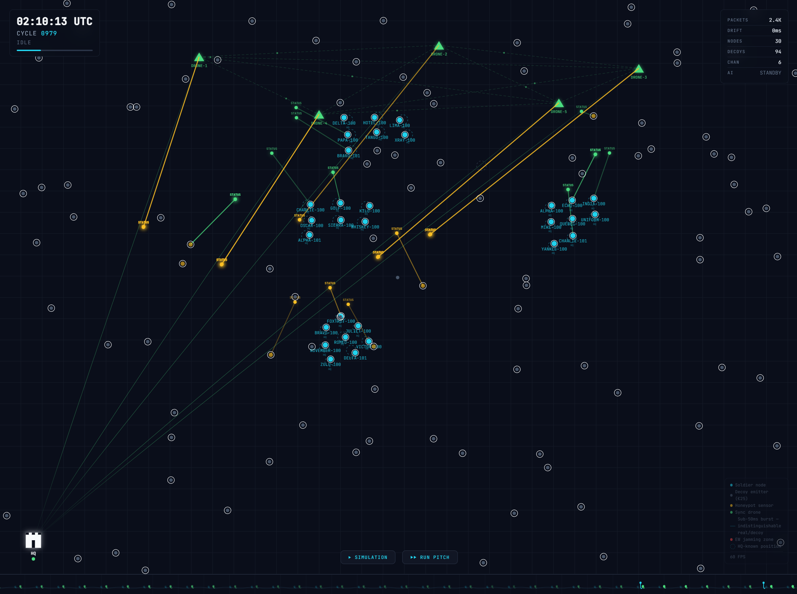
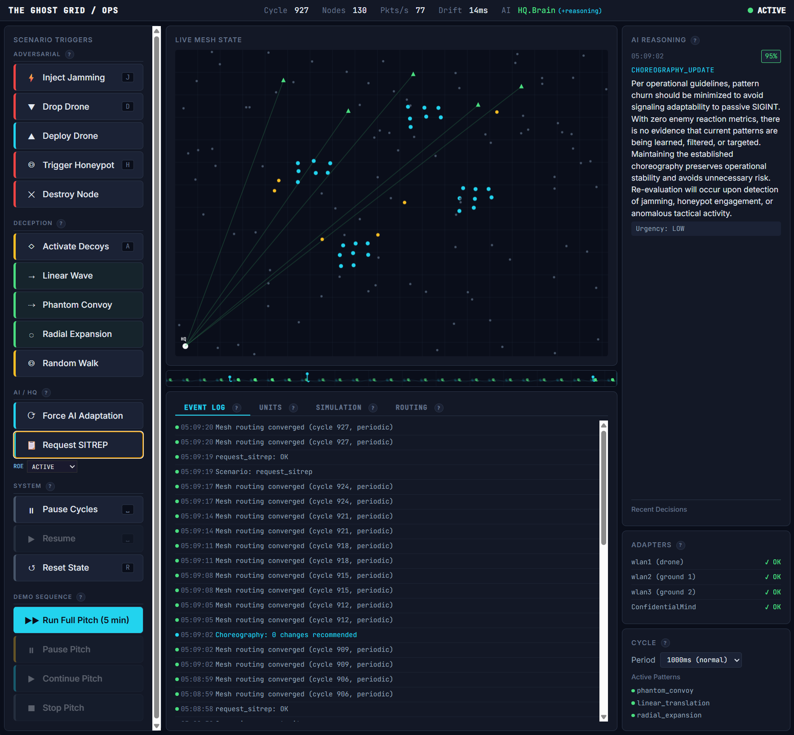
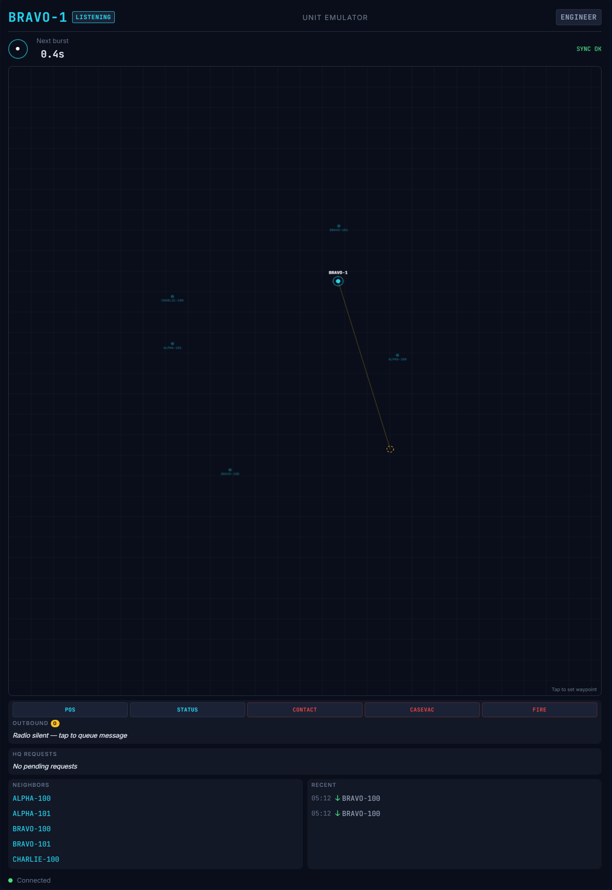

# THE GHOST GRID

*Junction × Aalto Defence Hackathon 2026*

**Drone-coordinated tactical mesh communications for contested electromagnetic environments.**

*Everything the enemy sees is a lie.*

---

| Landing | Big Screen | Operator Dashboard | Unit Emulator |
|:---:|:---:|:---:|:---:|
|  |  |  |  |
| Entry point with project overview and QR code | Real-time battlefield visualization — sync pulses, decoys, bursts, AI reasoning | Scenario triggers, event log, simulation controls | Phone-based soldier node — tactical map, burst messaging, mesh status |

---

## Why this exists

In contested electromagnetic environments, every radio that transmits can be located, classified, jammed, or destroyed. Existing tactical mesh radios work well in benign conditions but fail at predictable points: GPS-dependent time discipline collapses under wideband jamming, master-radio sync exposes high-value targets, and ground-emission patterns leak position information to modern multi-channel SIGINT.

Off-the-shelf mesh networks are leaky, predictable, and too expensive to fit the economics of modern attritional warfare. THE GHOST GRID is a proof-of-concept that asks: what if the communications architecture itself was the deception system?

## How it works

A fiber-tethered drone provides synchronization that electronic warfare cannot reach. The drone is connected to HQ by physical fiber — its sync signal hangs above the battlefield where no jammer can touch it.

Within the precise time windows the sync defines, three kinds of traffic fire simultaneously across hopping frequencies:

- **Real messages** from real units
- **Decoy emitters** producing protocol-correct traffic indistinguishable at the cryptographic level from real
- **Cover signal** masking the spatial signature of every burst

To enemy SIGINT, the result is uniform noise. To anyone holding the sync and the keys, every message lands where it should.

## The economic argument

A €25-class decoy emitter is orders of magnitude cheaper than the precision weapons or jamming systems an adversary would deploy against it. Lancet-class loitering munitions cost approximately $35,000 per unit; high-end jamming systems run into millions.

Saturate a sector with cheap emitters. Mix real traffic into the same mesh under the same sync. The enemy's targeting decisions become economically unsustainable, the intelligence picture becomes uncertain, and friendly information flow continues through the noise.

The deception is not a separate system bolted onto the radio — the radio IS the deception.

## Four pillars

| Pillar | What it does |
|--------|-------------|
| **Sync Beacon** | Fiber-tethered drone provides GPS-independent time discipline. No master ground radio, no central point to direction-find and destroy. |
| **Burst Mesh** | Sub-50ms transmission windows with frequency hopping and cover signal. Self-healing routing reconverges around jammed sectors and lost nodes. |
| **Statistical Deception** | Decoy emitters execute the same protocol state machine as real units. Wave choreography simulates movement. Honeypot sensors detect enemy engagement and cascade alerts through the mesh. |
| **Adaptive AI** | HQ brain on air-gappable LLM (ConfidentialMind) with audit trail and ROE constraints. Classifies events, adapts deception choreography to observed enemy reactions. |

## What's built

The full software stack runs end-to-end:

- Three protocol layers (Transmission, Mesh, Application) wired into runtime data flow
- Real cryptographic frame format: ChaCha20-Poly1305 AEAD, HKDF-derived per-cycle keys, HMAC-SHA256 frame MAC
- 47-decoy deception engine with four wave patterns and honeypot active sensing
- AI tactical and operational loops integrated with ConfidentialMind
- Real-time visualization: operator big screen, dashboard, audience phone client
- Three USB WiFi adapters integrated at the radio bridge layer

## What's designed but not built

- ESP32 + LoRa decoy hardware (architecture and BOM specified, no physical units)
- Adversarial validation of statistical indistinguishability claims at the SIGINT level
- Production deployment infrastructure

## Explore

| Path | What you see |
|------|-------------|
| `/` | Landing page — project overview and QR code to join |
| `/screen` | Big Screen — live mesh activity, sync pulses, decoys, bursts, AI reasoning |
| `/ops` | Operator Dashboard — scenario controls, event log, `(?)` help dialogs for each subsystem |
| `/phone` | Unit Emulator — soldier's phone interface into the mesh |

Click **Run Pitch** in `/ops` for a guided 5-minute demonstration of the whole system.

## Quick start

```bash
npm install
cp .env.example .env    # edit as needed
npm start               # http://localhost:7620
```

## Development

```bash
npm run dev   # starts with --watch for auto-reload
```

## Radio Bridge (Rust)

Requires **Rust 1.85+** (edition2024 support).

```bash
cd radios
cargo build --release
cargo test
cargo run -- --simulate     # no hardware required
```

See [`radios/README.md`](radios/README.md) for USB WiFi adapter setup and server integration.

## Testing

```bash
npm test                    # all tests (protocol + deception + hq-brain)
npm run test:protocol       # protocol modules only
npm run test:deception      # deception engine only
npm run test:hq-brain       # HQ brain (stub LLM, no dependencies)
npm run test:hq-brain-live  # HQ brain with real LLM (needs Ollama or ConfidentialMind)
npm run lint                # ESLint
```

## Honest framing

Built during a 48-hour hackathon event with significant AI acceleration in documentation and code generation. Software components at TRL 4; hardware and full RF integration at TRL 2–3. Transparency log in [`HISTORY-LOG.md`](HISTORY-LOG.md).

## Documentation

Full design specification: [`docs/00-README.md`](docs/00-README.md) · Build components: [`docs/06-build-components.md`](docs/06-build-components.md)

---

*Junction × Aalto Defence Hackathon 2026 — THE GHOST GRID by Jouni Miikki*
